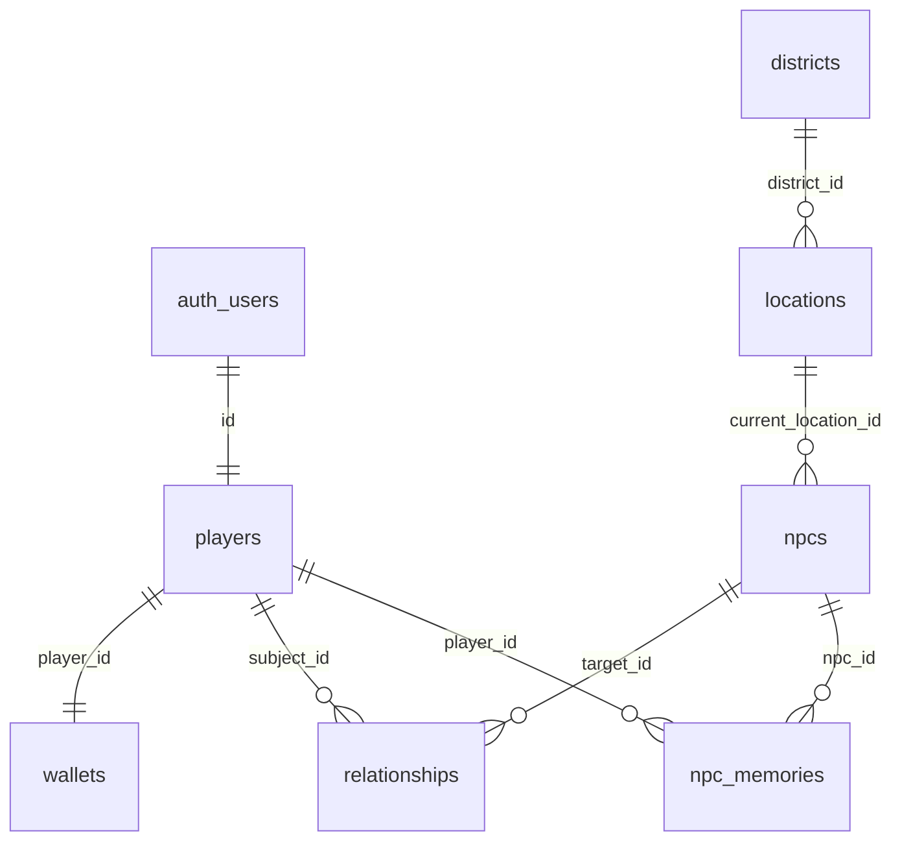

# WORLD-MODEL-SPEC v0.1

## Authoritative rule

> The World Model is authoritative.  
> Unity renders and interacts with the World Model.  
> Gemini interprets the World Model but cannot directly mutate authoritative state.

## Pass question

**Where does every piece of game state live?**

Answer: in **PostgreSQL** (Supabase). Contracts live in `world-model/schemas` and `world-model/types`. Unity and Gemini never hold authoritative money, inventory, reputation, or progression.

See `world-model/README.md` for the full ownership table.

## Artifacts

| Artifact | Path |
|----------|------|
| Ownership map | `world-model/README.md` |
| JSON Schema | `world-model/schemas/*.schema.json` |
| TypeScript | `world-model/types/index.ts` |
| Postgres mapping | `world-model/mappings/postgresql.md` |
| ER diagram | `world-model/diagrams/er.mmd` |

## Live vs planned

**Live (Gate 1):** Player, Wallet, Location, Npc, Relationship, WorldState  

**Planned (schemas only):** District, Business, Vehicle, Property, Item, Inventory, WalletTransaction, Job, Event, Mission, Reputation, NpcMemory, Message, SocialPost, GameSession  

Migrations for planned entities land in later gates when gameplay needs them — not before.

## ER (Mermaid)

Full diagram: `world-model/diagrams/er.mmd`
